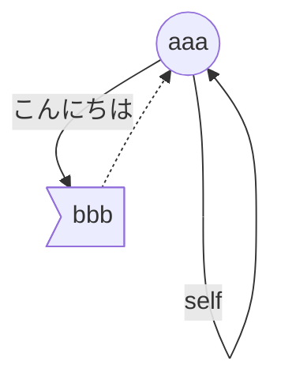
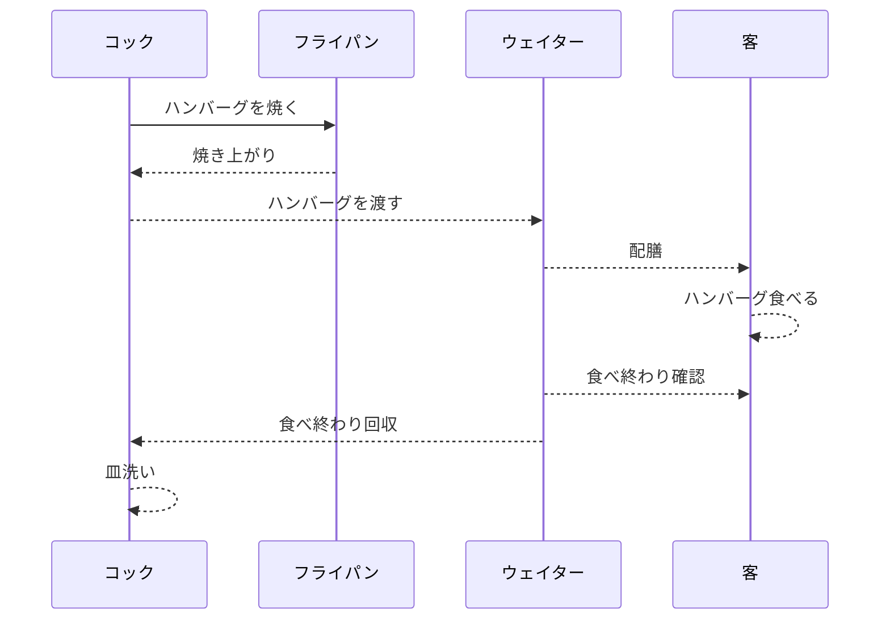

# mermaid-sandbox
mermaid記法の練習

```mermaid
graph TB
  A(("aaa"))--"こんにちは"-->B>"bbb"]
  B-.->A
  A--self-->A

```

```mermaid
sequenceDiagram
    コック ->> フライパン: ハンバーグを焼く
    フライパン -->> コック: 焼き上がり
    コック -->>  ウェイター: ハンバーグを渡す
    ウェイター　-->> 客: 配膳
    客 -->> 客: ハンバーグ食べる
    ウェイター -->> 客: 食べ終わり確認
    ウェイター　-->> コック: 食べ終わり回収
    コック -->> コック: 皿洗い

```
