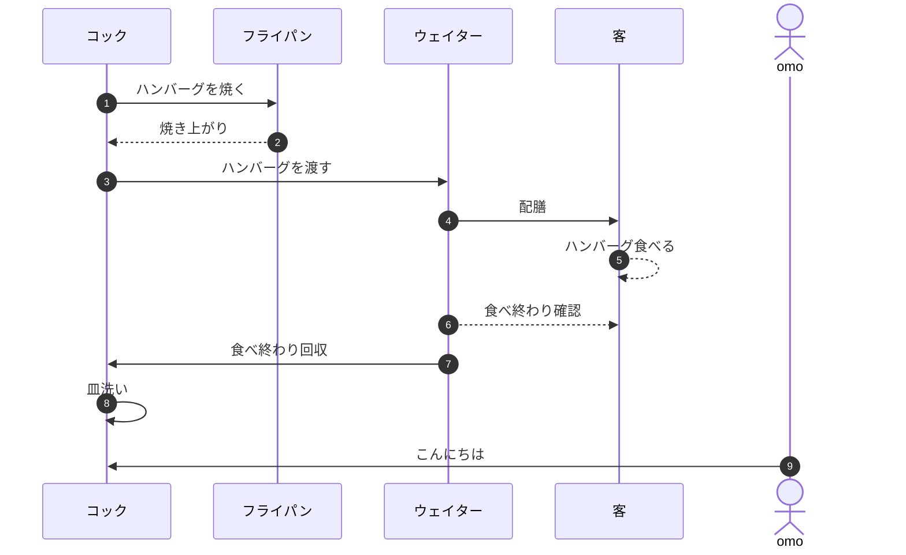
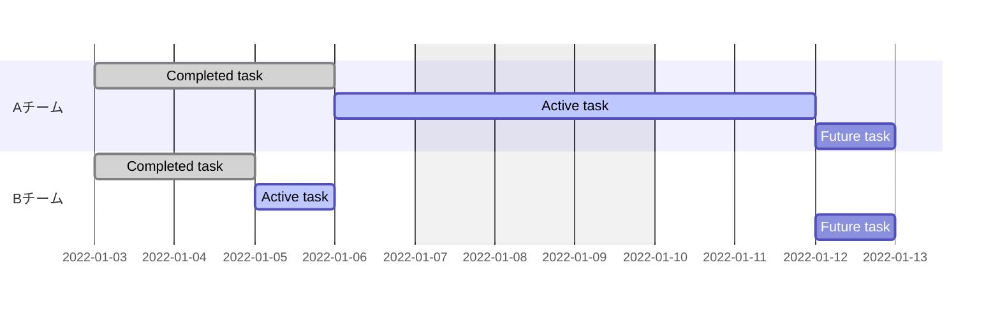

# mermaid-sandbox
mermaid記法の練習

```mermaid
graph TB
  A(("aaa"))--"こんにちは"-->B>"bbb"]
  B-.->A
  A--self-->A
```

```mermaid
sequenceDiagram
    autonumber
    コック ->> フライパン: ハンバーグを焼く
    フライパン -->> コック: 焼き上がり
    コック ->>  ウェイター: ハンバーグを渡す
    ウェイター　->> 客: 配膳
    客 -->> 客: ハンバーグ食べる
    ウェイター -->> 客: 食べ終わり確認
    ウェイター　->> コック: 食べ終わり回収
    コック ->> コック: 皿洗い
    actor omo
    omo ->> コック: こんにちは
```

```mermaid
gantt
  dateFormat YYYY-MM-DD
  excludes 2022-01-07, weekends

  section Aチーム
  Completed task :done,   a1, 2022-01-03, 3d
  Active task    :active, a2, after a1,   3d
  Future task    :        a3, after a2,   1d

  section Bチーム
  Completed task :done,   b1, 2022-01-03, 2d
  Active task    :active, b2, after b1,   1d
  Future task    :        b3, after a2,   1d
```
